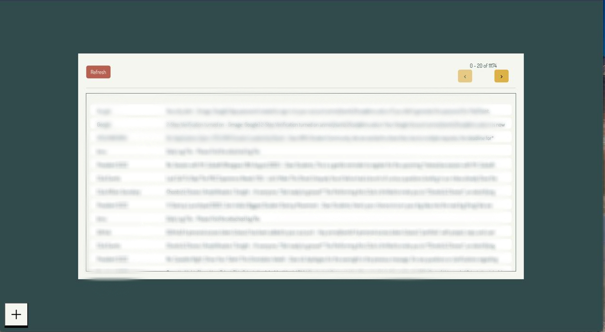

# 📧 Web Mail Client

A full-stack, real-time web application that functions as a third-party email client. This project was developed for a computer networking course to gain a practical understanding of email protocols (**IMAP/SMTP**) and real-time web communication using **WebSockets**.



## Features ✨

* **Direct Mail Server Connection:** Authenticates and interacts directly with your mail provider.
* **Real-time Inbox:** Uses an active IMAP connection to listen for new emails and updates the UI instantly.
* **Full CRUD Functionality:** Fetch, read, compose, and send emails.
* **Schedule Emails:** Write an email now and schedule it to be sent at a future date and time.
* **Decoupled Architecture:** Separate scripts to run the frontend and backend servers independently.

---

## ⚠️ Important: Use a Gmail App Password

To connect to a Google Account, you **must** use an **App Password**. Your regular password will not work due to Google's security policies for third-party applications.

1.  Go to your Google Account: [myaccount.google.com](https://myaccount.google.com/).
2.  Navigate to the **Security** tab.
3.  Ensure **2-Step Verification** is turned ON. You cannot create App Passwords without it.
4.  Click on **App passwords**. You may be asked to sign in again.
5.  In the "Select app" dropdown, choose **"Mail"**.
6.  In the "Select device" dropdown, choose **"Other (Custom name)"** and give it a name like "NodeMailClient".
7.  Google will generate a **16-character password**. Copy this password and use it in the login form of this application.

---

## Setup and Usage

This project is a monorepo containing both the `server` and `client`. The client and server are designed to be built and run as separate processes.

### Prerequisites
* Node.js
* Yarn (`npm install -g yarn`)
* A Gmail account with an App Password generated (see above).

### 1. Installation

First, clone the repository and install all dependencies for both the client and server using the custom `depI` script.

```bash
# Clone the repository
git clone [https://github.com/anmoljhamb/MailClient.git](https://github.com/anmoljhamb/MailClient.git)
cd MailClient

# Install all dependencies
yarn run depI
````

### 2\. Build the Application

The client and server must be built separately.

```bash
# Build the React client
yarn run build-client

# Build the Node.js server
yarn run build-server
```

### 3\. Run the Application

You will need **two separate terminal windows** to run the backend and frontend servers simultaneously.

**In your first terminal, start the backend server:**

```bash
# This will run on http://localhost:8080
yarn run start-server
```

**In your second terminal, start the frontend server:**

```bash
# This will serve the built client, likely on http://localhost:3000
yarn run start-client
```

### 4\. Access the App

Once both servers are running, open your browser and navigate to the **frontend server's address** (typically `http://localhost:3000`) to use the application.
